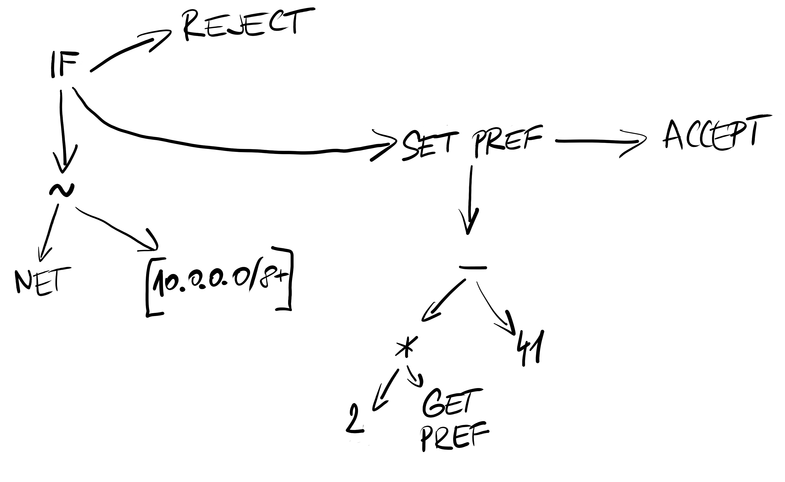

# BIRD Journey to Threads. Chapter 0: The Reason Why.

BIRD is a fast, robust and memory-efficient routing daemon designed and
implemented at the end of 20th century. Its concept of multiple routing
tables with pipes between them, as well as a procedural filtering language,
has been unique for a long time and is still one of main reasons why people use
BIRD for big loads of routing data.

## IPv4 / IPv6 duality: Solved

The original design of BIRD has also some drawbacks. One of these was an idea
of two separate daemons – one BIRD for IPv4 and another BIRD for IPv6, built from the same
codebase, cleverly using `#ifdef IPV6` constructions to implement the
common parts of BIRD algorithms and data structures only once.
If IPv6 adoption went forward as people thought in that time,
it would work; after finishing the worldwide transition to IPv6, people could
just stop building BIRD for IPv4 and drop the `#ifdef`-ed code.

The history went other way, however. BIRD developers therefore decided to *integrate*
these two versions into one daemon capable of any address family, allowing for
not only IPv6 but for virtually anything. This rework brought quite a lot of
backward-incompatible changes, therefore we decided to release it as a version 2.0.
This work was mostly finished in 2018 and as for March 2021, we have already
switched the 1.6.x branch to a bugfix-only mode.

## BIRD is single-threaded now

The second drawback is a single-threaded design. Looking back to 1998, this was
a good idea. A common PC had one single core and BIRD was targeting exactly
this segment. As the years went by, the manufacturers launched multicore x86 chips
(AMD Opteron in 2004, Intel Pentium D in 2005). This ultimately led to a world
where as of March 2021, there is virtually no new PC sold with a single-core CPU.

Together with these changes, the speed of one single core has not been growing as fast
as the Internet is growing. BIRD is still capable to handle the full BGP table 
(868k IPv4 routes in March 2021) with one core, anyway when BIRD starts, it may take
long minutes to converge.

## Intermezzo: Filters

In 2018, we took some data we had from large internet exchanges  and simulated
a cold start of BIRD as a route server. We used `linux-perf` to find most time-critical
parts of BIRD and it pointed very clearly to the filtering code. It also showed that the
IPv4 version of BIRD v1.6.x is substantially faster than the *integrated* version, while
the IPv6 version was quite as fast as the *integrated* one.

Here we should show a little bit more about how the filters really work. Let's use
an example of a simple filter:

```
filter foo {
  if net ~ [10.0.0.0/8+] then reject;
  preference = 2 * preference - 41;
  accept;
}
```

This filter gets translated to an infix internal structure.



When executing, the filter interpreter just walks the filter internal structure recursively in the
right order, executes the instructions, collects their results and finishes by
either rejection or acceptation of the route

## Filter rework

Further analysis of the filter code revealed an absurdly-looking result. The
most executed parts of the interpreter function were the `push` CPU
instructions on its very beginning and the `pop` CPU instructions on its very
end. This came from the fact that the interpreter function was quite long, yet
most of the filter instructions used an extremely short path, doing all the
stack manipulation at the beginning, branching by the filter instruction type,
then it executed just several CPU instructions, popped everything from the
stack back and returned.

After some thoughts how to minimize stack manipulation when everything you need
is to take two numbers and multiply them, we decided to preprocess the filter
internal structure to another structure which is much easier to execute. The
interpreter is now using a data stack and behaves generally as a
postfix-ordered language. We also thought about Lua which showed up to be quite
a lot of work implementing all the glue achieving about the same performance.

After these changes, we managed to reduce the filter execution time by 10–40%,
depending on how complex the filter is.
Anyway, even this reduction is quite too little when there is one CPU core
running for several minutes while others are sleeping.

## We need more threads

As a side effect of the rework, the new filter interpreter is also completely
thread-safe. It seemed to be the way to go – running the filters in parallel
while keeping everything else single-threaded. The main problem of this
solution is a too fine granularity of parallel jobs. We would spend lots of
time on synchronization overhead.

The only filter parallel execution was also too one-sided, useful only for
configurations with complex filters. In other cases, the major problem is best
route recalculation, OSPF recalculation or also kernel synchronization.
It also turned out to be dirty a lot from the code cleanliness' point of view.

Therefore we chose to make BIRD multithreaded completely. We designed a way how
to gradually enable parallel computation and best usage of all available CPU
cores. Our goals are three:

* We want to keep current functionality. Parallel computation should never drop
  a useful feature.
* We want to do little steps. No big reworks, even though even the smallest
  possible step will need quite a lot of refactoring before.
* We want to be backwards compatible as much as possible.

*It's still a long road to the version 2.1. This series of texts should document
what is needed to be changed, why we do it and how. In the next chapter, we're
going to describe the structures for routes and their attributes. Stay tuned!*
