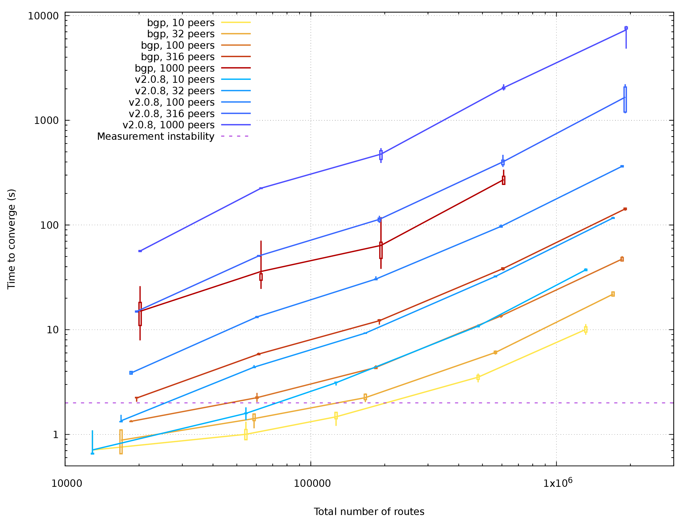
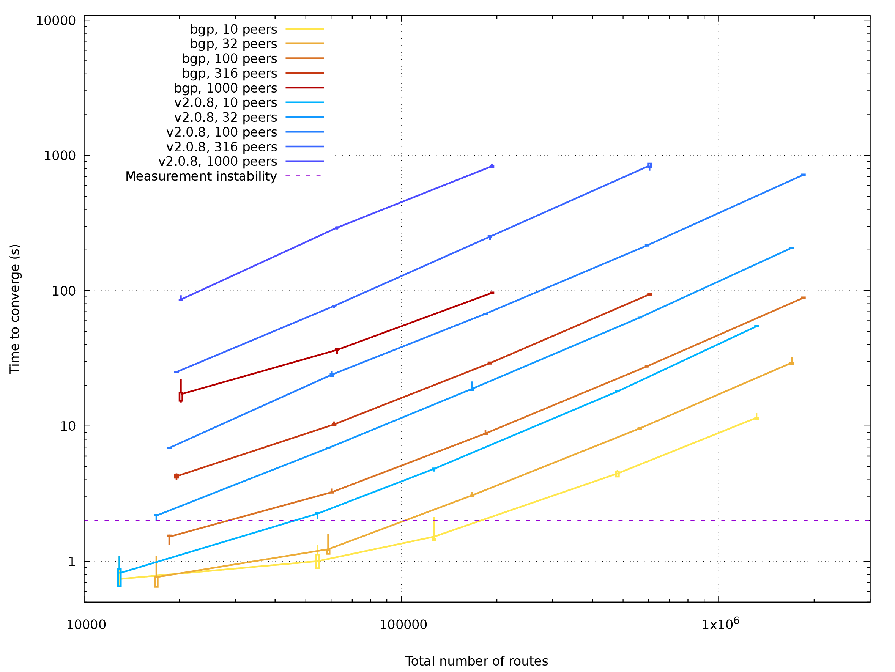
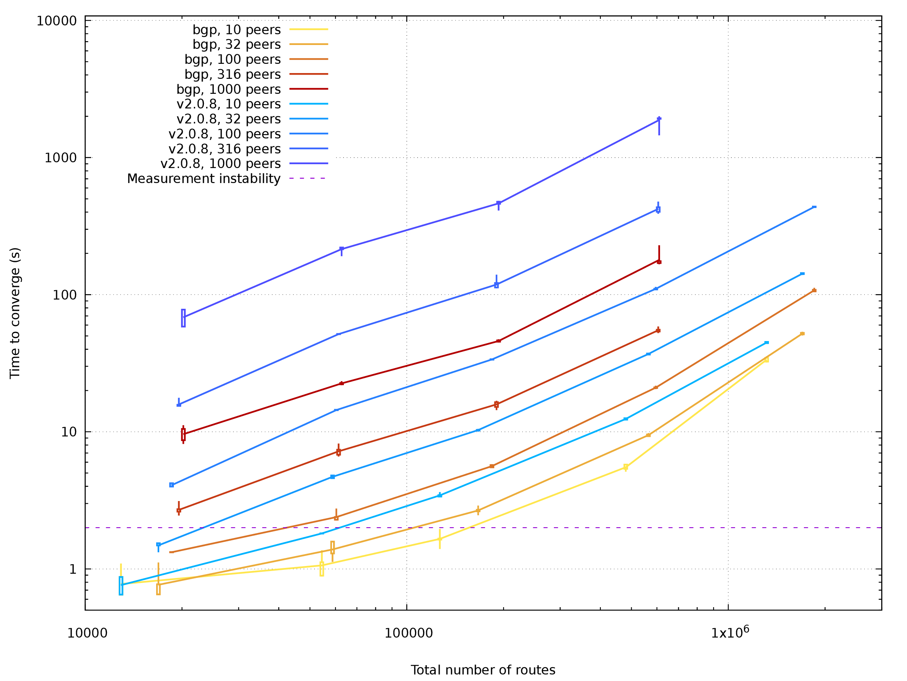
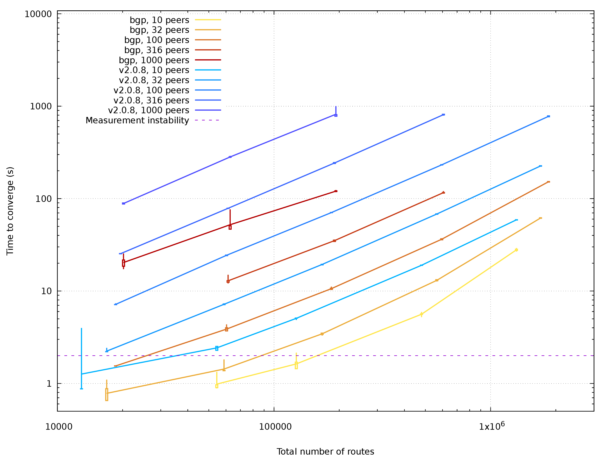

# BIRD Journey to Threads. Chapter 3½: Route server performance

All the work on multithreading shall be justified by performance improvements.
This chapter tries to compare times reached by version 3.0-alpha0 and 2.0.8,
showing some data and thinking about them.

BIRD is a fast, robust and memory-efficient routing daemon designed and
implemented at the end of 20th century. We're doing a significant amount of
BIRD's internal structure changes to make it run in multiple threads in parallel.

## Testing setup

There are two machines in one rack. One of these simulates the peers of
a route server, the other runs BIRD in a route server configuration. First, the
peers are launched, then the route server is started and one of the peers
measures the convergence time until routes are fully propagated. Other peers
drop all incoming routes.

There are four configurations. *Single* where all BGPs are directly
connected to the main table, *Multi* where every BGP has its own table and
filters are done on pipes between them, and finally *Imex* and *Mulimex* which are
effectively *Single* and *Multi* where all BGPs have also their auxiliary
import and export tables enabled.

All of these use the same short dummy filter for route import to provide a
consistent load. This filter includes no meaningful logic, it's just some dummy
data to run the CPU with no memory contention. Real filters also do not suffer from
memory contention, with an exception of ROA checks. Optimization of ROA is a
task for another day.

There is also other stuff in BIRD waiting for performance assessment. As the
(by far) most demanding setup of BIRD is route server in IXP, we chose to
optimize and measure BGP and filters first.

Hardware used for testing is Intel(R) Xeon(R) CPU E5-2630 v3 @ 2.40GHz with 8
physical cores, two hyperthreads on each. Memory is 32 GB RAM.

## Test parameters and statistics

BIRD setup may scale on two major axes. Number of peers and number of routes /
destinations. *(There are more axes, e.g.: complexity of filters, routes /
destinations ratio, topology size in IGP)*

Scaling the test on route count is easy, just by adding more routes to the
testing peers. Currently, the largest test data I feed BIRD with is about 2M
routes for around 800K destinations, due to memory limitations. The routes /
destinations ratio is around 2.5 in this testing setup, trying to get close to
real-world routing servers.[^1]

[^1]: BIRD can handle much more in real life, the actual software limit is currently
      a 32-bit unsigned route counter in the table structure. Hardware capabilities
      are already there and checking how BIRD handles more than 4G routes is
      certainly going to be a real thing soon.

Scaling the test on peer count is easy, until you get to higher numbers. When I
was setting up the test, I configured one Linux network namespace for each peer,
connecting them by virtual links to a bridge and by a GRE tunnel to the other
machine. This works well for 10 peers but setting up and removing 1000 network
namespaces takes more than 15 minutes in total. (Note to myself: try this with
a newer Linux kernel than 4.9.)

Another problem of test scaling is bandwidth. With 10 peers, everything is OK.
With 1000 peers, version 3.0-alpha0 does more than 600 Mbps traffic in peak
which is just about the bandwidth of the whole setup. I'm planning to design a
better test setup with less chokepoints in future.

## Hypothesis

There are two versions subjected to the test. One of these is `2.0.8` as an
initial testpoint. The other is version 3.0-alpha0, named `bgp` as parallel BGP
is implemented there.

The major problem of large-scale BIRD setups is convergence time on startup. We
assume that a multithreaded version should reduce the overall convergence time,
at most by a factor equal to number of cores involved. Here we have 16
hyperthreads, in theory we should reduce the times up to 16-fold, yet this is
almost impossible as a non-negligible amount of time is spent in bottleneck
code like best route selection or some cleanup routines. This has become a
bottleneck by making other parts parallel.

## Data

Four charts are included here, one for each setup. All axes have a
logarithmic scale. The route count on X scale is the total route count in
tested BIRD, different color shades belong to different versions and peer
counts. Time is plotted on Y scale.

Raw data is available in Git, as well as the chart generator. Strange results
caused by testbed bugs are already omitted.

There is also a line drawn on a 2-second mark. Convergence is checked by
periodically requesting `birdc show route count` on one of the peers and BGP
peers have also a 1-second connect delay time (default is 5 seconds). All
measured times shorter than 2 seconds are highly unreliable.

[Plotted data for Single in PDF](03b_stats_2d_single.pdf)

Single-table setup has times reduced to about 1/8 when comparing 3.0-alpha0 to
2.0.8. Speedup for 10-peer setup is slightly worse than expected and there is
still some room for improvement, yet 8-fold speedup on 8 physical cores and 16
hyperthreads is good for me now.

The most demanding case with 2M routes and 1k peers failed. On 2.0.8, my
configuration converges after almost two hours on 2.0.8, with the speed of
route processing steadily decreasing until only several routes per second are
done. Version 3.0-alpha0 is memory-bloating for some non-obvious reason and
couldn't fit into 32G RAM. There is definitely some work ahead to stabilize
BIRD behavior with extreme setups.

[Plotted data for Multi in PDF](03b_stats_2d_multi.pdf)

Multi-table setup got the same speedup as single-table setup, no big
surprise. Largest cases were not tested at all as they don't fit well into 32G
RAM even with 2.0.8.

[Plotted data for Imex in PDF](03b_stats_2d_imex.pdf)

[Plotted data for Mulimex in PDF](03b_stats_2d_mulimex.pdf)

Setups with import / export tables are also sped up by a factor
about 6-8. Data on largest setups (2M routes) are showing some strangely
ineffective behaviour. Considering that both single-table and multi-table
setups yield similar performance data, there is probably some unwanted
inefficiency in the auxiliary table code.

## Conclusion

BIRD 3.0-alpha0 is a good version for preliminary testing in IXPs. There is
some speedup in every testcase and code stability is enough to handle typical
use cases. Some test scenarios went out of available memory and there is
definitely a lot of work to stabilize this, yet for now it makes no sense to
postpone this alpha version any more.

We don't recommend upgrading a production machine to this version
yet, anyway if you have a test setup, getting version 3.0-alpha0 there and
reporting bugs is much welcome.

Notice: Multithreaded BIRD, at least in version 3.0-alpha0, doesn't limit its number of
threads. It will spawn at least one thread per every BGP, RPKI and Pipe
protocol, one thread per every routing table (including auxiliary tables) and
possibly several more. It's up to the machine administrator to setup a limit on
CPU core usage by BIRD. When running with many threads and protocols, you may
need also to raise the filedescriptor limit: BIRD uses 2 filedescriptors per
every thread for internal messaging.

*It's a long road to the version 3. By releasing this alpha version, we'd like
to encourage every user to try this preview. If you want to know more about
what is being done and why, you may also check the full
[blogpost series about multithreaded BIRD](https://en.blog.nic.cz/2021/03/15/bird-journey-to-threads-chapter-0-the-reason-why/). Thank you for your ongoing support!*
